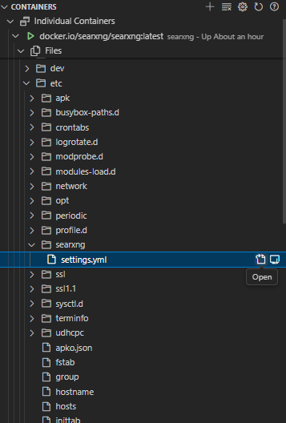
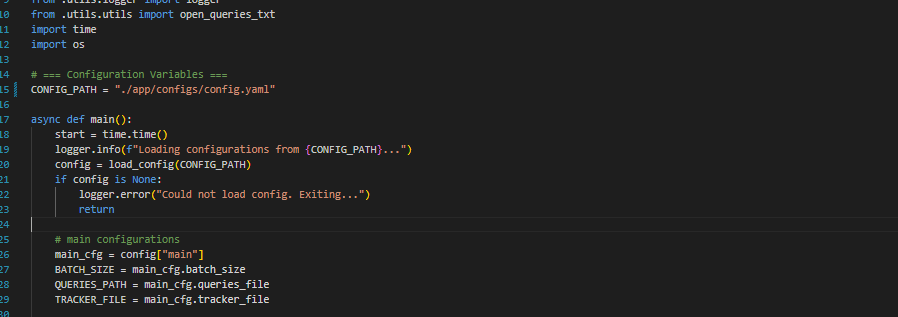
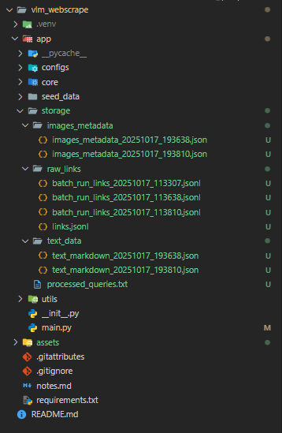

# VLM Webscrape 2

A lightweight, high-throughput crawler that fans out across Google/Bing/SearXNG (including image search), collects result links, then scrapes pages for **all page text**, **image metadata**, and **image-surrounding context**. Designed to batch queries (to respect SearXNG rate limits), persist progress, and produce JSON you can post-process or download for filtering.

---

## What this is

- **Goal:** Widespread crawl using classic web search and image search to assemble training/eval corpora focused on Singapore-related content.  
- **How it filters:** After scraping, an **LLM (served via vLLM)** is used to filter content to Singapore relevance.  
- **Outputs you care about:** Per-run `image_metadata.json` files (one per batch/file) summarizing images, their pages, alt text/captions, and nearby text—ideal for downstream downloading & filtering.

### Tech stack

- **Python** app (packaged as `app`, entrypoint `python -m app.main`)
- **Playwright** for robust page fetching (+ its browser runtime)
- **SearXNG** meta-search (self-hosted via official Docker image)
- **vLLM** OpenAI-compatible HTTP server (LLM endpoint used for SG filtering)
- **Filesystem** persistence under `./storage`

### High-level process flow

1. **Read queries** from your text file (see `configs/config.yml`).
2. **Search** across engines (general + image) using the searXNG engine (self-host on docker).
4. **Collect & dedupe links** → each batch persist into `./storage/raw_links` as well as a global links in `./storage/raw_links/links.jsonl`.
5. **Scrape** each link:
   - Extract full page text → `./storage/text_data`, batch by batch `*.json` files with the naming convention -> `text_markdown_<datetime>.json`
   - Extract images + surrounding text → `./storage/images_metadata`, batch by batch `*.json` files with the naming convention -> `images_metadata_<datatime>.json`
6. **Filter (LLM)** the links and as well as the content for Singapore-relatedness via your vLLM endpoint.
7. **Record progress** so reruns resume → `./storage/processed_queries.txt`.

---

## Setup guide

> Tested with Docker for SearXNG and a local/remote vLLM server. Use a Python 3.10+ venv.

### 0) Clone & Python deps

```bash
git clone https://github.com/Leeeef552/vlm_webscrape_2
cd vlm_webscrape_2

python -m venv .venv
source .venv/bin/activate  # Windows: .venv\Scriptsctivate

pip install -r requirements.txt
playwright install
```

### 1) Set up SearXNG (official image)

**Run the container (choose a host port):**
```bash
# create a local config folder you can mount into the container
mkdir -p searxng # optional

docker pull searxng/searxng

# start SearXNG; maps host 8081 -> container 8080 and mounts /etc/searxng
docker run -d --name searxng   -p 8081:8080   -v "$(pwd)/searxng:/etc/searxng"   searxng/searxng
```
- main thing is to run the container and ensure its accessible via the port
- find the `settings.yml` file
- The container’s **settings file lives at** `/etc/searxng/settings.yml`.

**Edit `settings.yml`:**
- Open `./searxng/settings.yml` on your host (because we mounted that dir into `/etc/searxng`).
- Replace it with your tuned config (or copy in your own `settings.yml`).
- You can do it via VS Code too



**Restart SearXNG to apply changes:**
```bash
docker restart searxng
```

### 2) Configure the app (`./configs/config.yml`)
- This config.yml contains configurations for the webscraping run.
- Create or edit `./configs/config.yml` with your paths and endpoints

### 3) Make sure your vLLM endpoint is running
- Run a local vLLM server (or point to an existing one) an expose it as an OpenAI-compatible HTTP server endpoint 
- eg. `http://localhost:8000/v1`. (this should align with the llm endpoint in ./configs/config.yml)

### 4) Point `main.py` at your config
- Open `app/main.py` and set the config path it loads to match **`./configs/config.yml`** above (some versions store this as a constant or CLI arg). Ensure the file path is correct for your environment.


### 5) Run

From the **repo root**:

```bash
python -m app.main
```

---

## Outputs & folder structure

On first run, the app auto-creates `./storage` plus subfolders and a progress file:


```
./storage/
  images_metadata/          # JSON files with image-level metadata + surrounding text
  raw_links/                # raw and/or deduped URLs gathered from search
  text_data/                # scraped plain text (one file per page / per batch)
  processed_queries.txt     # log of which queries have been processed
```

**What’s in each:**

- **`images_metadata/*.json`** – the most useful artifact for image workflows. Contains per-image records: source page URL, direct image URL (when resolvable), alt/caption text, and **nearby text context** captured during scraping, plus any query/batch bookkeeping the code records.  
- **`raw_links/*`** – link dumps from general + image search before/after dedupe (useful for auditing).  
- **`text_data/*`** – page-level extracted text for downstream NLP/heuristics.  
- **`processed_queries.txt`** – the app appends completed queries here so reruns can resume safely without re-hitting SearXNG.

> The **main entry** batches queries to respect SearXNG rate limits and pacing, reducing engine bans or throttles.

---

## Usage notes & tips

- **SearXNG categories/engines:** You can tune which engines (e.g., Google, Bing, images) are enabled in `settings.yml`.  
- **Local testing:** Start with a tiny `queries.txt` (3–5 lines) and `batch_size: 2`, then scale.  
- **Playwright browsers:** If you switch machines/containers, re-run `playwright install`.  
- **vLLM models:** Choose a model that’s fast at inference
```bash
# Run on a single 80GB H100
CUDA_VISIBLE_DEVICES=3 vllm serve Qwen/Qwen3-30B-A3B-Instruct-2507 --port 8123 --gpu-memory-utilization 0.9 --max-model-len 24k
```

---

## Quick checklist (TL;DR)

- [ ] `pip install -r requirements.txt` + `playwright install`  
- [ ] Run SearXNG Docker on a known **port**  
- [ ] Replace `/etc/searxng/settings.yml` with your config (copy and paste from `./configs/settings_for_searxng.yml`), **restart container**  
- [ ] Start **vLLM** (OpenAI-compatible) and note `base_url`/`model`/`api_key`  
- [ ] Fill `./configs/config.yml` with correct paths + endpoints  
- [ ] In `app/main.py`, point to that config path  
- [ ] `python -m app.main` from repo root  
- [ ] After run: use `./storage/images_metadata/*.json` for download/filtering
